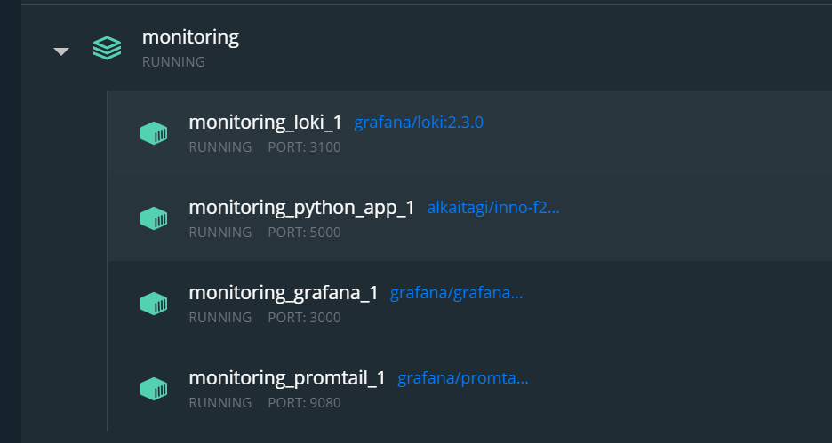
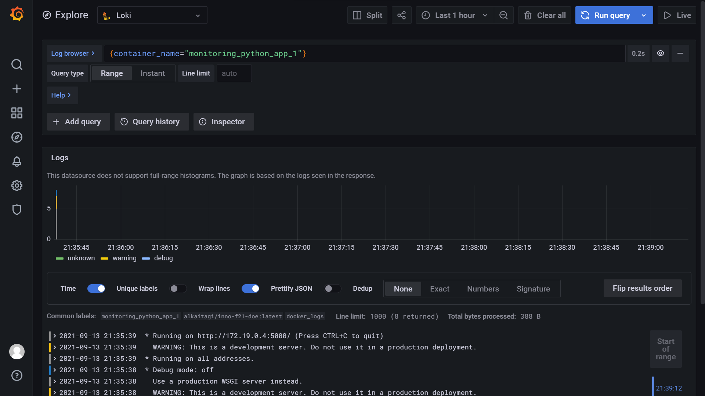

# Logging

Logging is done using the PLG stack (Promtail, Loki, and Grafana).

## Running

1. Run apps

   ```sh
   docker-compose pull
   docker-compose up
   ```

2. Open Grafana at [http://localhost:3000/](`http://localhost:3000/`).
3. Add Loki data source at [http://loki:3100/](http://loki:3100/).
4. See the logs at "Explore" tab.

## Best practices

### Loki

- Prefer using static labels.
- Only use dynamic labels if you really need to.
- Label values must always be bounded.
- Configure caching.
- Send logs in increasing time order.
- Make use of `chunk_target_size`.
- Follow [Loki best practices docs](https://grafana.com/docs/loki/latest/best-practices/).

### Grafana

- Have simple dashboards as to reduce cognitive load.
- Have a specific goal in mind for each dashboard and give it a meaningful name.
- Avoid unnecessary refreshing, depending on how often the data changes.
- Reuse dashboards and use templates and variables to enforce consistency.
- Avoid copying dashboards for minor changes.
- Focus on the following 4 metrics:
  - Latency
  - Traffic
  - Errors
  - Saturation
- Follow [Grafana best practices docs](https://grafana.com/docs/grafana/latest/best-practices/).

## Screenshots

- Running containers:
  
- Loki logs:
  
